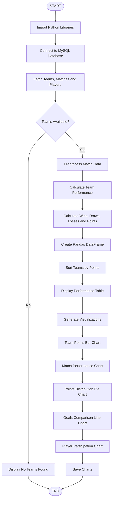

# SPORTIFY – DATA SCIENCE FLOWCHART

```mermaid
flowchart TD
    A([START]) --> B[Import Python Libraries]
    B --> C[Connect to MySQL Database]
    C --> D[Fetch Teams, Matches and Players]
    D --> E{Teams Available?}

    E -- No --> F[Display No Teams Found]
    F --> Z([END])

    E -- Yes --> G[Preprocess Match Data]
    G --> H[Calculate Team Performance]
    H --> I[Calculate Wins, Draws, Losses and Points]
    I --> J[Create Pandas DataFrame]
    J --> K[Sort Teams by Points]
    K --> L[Display Performance Table]

    L --> M[Generate Visualizations]
    M --> N[Team Points Bar Chart]
    N --> O[Match Performance Chart]
    O --> P[Points Distribution Pie Chart]
    P --> Q[Goals Comparison Line Chart]
    Q --> R[Player Participation Chart]
    R --> S[Save Charts]
    S --> Z
```
